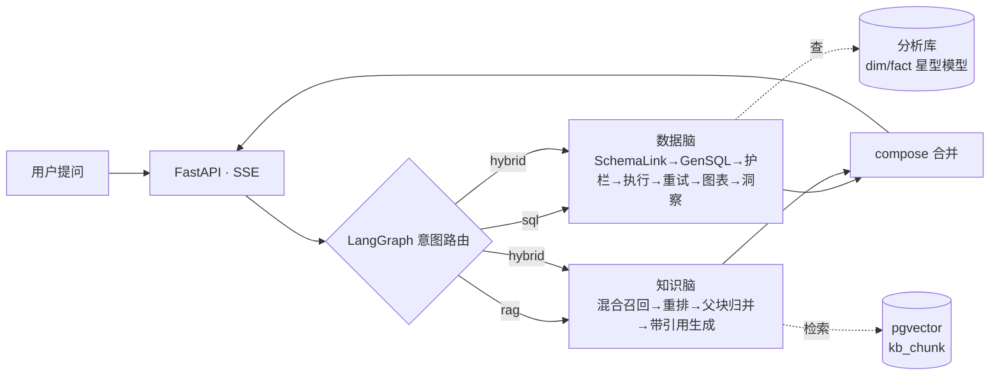

# EV-MarketLens (车市镜)

> 对话式新能源汽车市场情报 Agent：自然语言提问 → 自动判断意图 → 查库出图 / 检索报告带引用作答。LangGraph 编排双脑协同。

---

## Demo 状态

当前为本地演示版本，暂无公开在线 Demo。

---

## 核心能力

| 能力 | 说明 |
|------|------|
| 数据脑 (Text2SQL) | 自然语言 → Schema Linking → SQL 生成 → sqlglot AST 安全护栏 → 只读执行 → 自校验重试 → 图表描述符 |
| 知识脑 (RAG) | 结构感知父子分块 → BGE-large-zh 向量化 → 混合召回(向量+全文 RRF) → bge-reranker → 父块归并 → 带引用生成 |
| Agent 编排 | LangGraph 状态图：5 层 NLU 路由 → sql / rag / hybrid / clarify / chat，支持重试环、并行 fan-out、澄清挂起 |
| 长期记忆 | 有界线程池后台提取 → 用户画像 + 会话摘要 → 关键词召回注入 |
| 产品工程 | JWT 多租户 · SSE 流式 · Vue3+ECharts 前端 · Docker 部署 |

---

## 架构



---

## 一次请求调用链

```
用户提问 → intent_router (5层NLU)
  ├─ sql: schema_link → gen_sql → ensure_safe → exec_sql → verify_sql → chart → insight → compose
  ├─ rag: rag_retrieve → rag_answer → compose
  ├─ hybrid: [sql ∥ rag] 并行 → compose(defer=True)
  ├─ chat: chitchat → END
  └─ clarify: clarify → END
```

### Text2SQL 链路

1. **Schema Linking** — 语义描述匹配 + 实体信号增强
2. **SQL 生成** — LLM + domain prompt + few-shot
3. **安全护栏** — sqlglot AST 遍历，仅允许 SELECT
4. **执行** — 只读连接，失败回喂修正 (最多 2 次重试)
5. **语义自校验** — LLM 核对结果 vs 问题 (FAIL-OPEN)
6. **图表** — 规则引擎产出描述符，前端 ECharts 渲染

### RAG 链路

1. **文档入库** — 解析 → 结构感知父子分块 (子块~280token/父块~900token)
2. **混合召回** — 向量 + 全文，RRF(k=60) 融合
3. **Reranker** — bge-reranker (不可用时降级 RRF 分)
4. **父块归并** — 去重/相邻合并/预算裁剪/冲突并列
5. **生成** — 带引用，has_answer 防幻觉

### 长期记忆

- **L2 Episode**: 会话摘要 (仅从用户消息提取，禁止保存数字结论)
- **L3 Profile**: 用户偏好画像 (白名单: 品牌/指标/车型/输出风格)
- **调度**: ThreadPoolExecutor(2) + msg_count 新消息判定 + 进程内去重
- **召回**: 关键词匹配 + 时间衰减；无关键词时不注入
- **安全**: 敏感过滤、不可信数据标记、fail-open

---

## 评测方法

| 评测 | 方法 | 说明 |
|------|------|------|
| Text2SQL | 执行结果集等价比对 | 位置元组比较，等价 SQL 算对 |
| 意图路由 | 混淆矩阵 + per-class P/R/F1 | 100 条标注样本 |
| RAG | RAGAS-style LLM-judge 四指标 | 自实现 context precision/recall, faithfulness, answer relevancy |
| 数据质量 | GE-style 断言 | pytest 门禁 (表行数、枚举值、NULL 率) |

> 评测使用 RAGAS/GE 的**指标定义**自实现，非直接调用官方库。CI 通过 pytest 红线门禁把关。

---

## 当前可复现指标

以下基于本仓库代码 + 确定性测试验证 (不依赖 LLM)：

| 指标 | 值 | 方法 |
|------|---|------|
| 单元测试 | 180 passed | `pytest -m "not integration"` |
| Gold SQL 可执行率 | 60/60 | `--check-gold` |
| 意图规则测试 | 15/15 | 确定性 layer5 |
| 记忆安全测试 | 28/28 | mock LLM + SQLite |

> `eval/reports/` 中的历史报告为**旧基线** (对应历史数据/模型/配置)，不代表当前 commit 实时准确率。全量 LLM 评测需配置 API Key 后手动运行。

---

## 快速启动

### 环境

```bash
python -m venv .venv && source .venv/bin/activate
pip install -r requirements.txt
cp .env.example .env   # 填入 LLM_API_KEY
```

### 数据重建

本仓库**不附带数据库文件**，需自行采集：

```bash
python data/crawl_sales.py   # 采集懂车帝销量榜
python data/clean_load.py    # 清洗 → 星型模型 → SQLite
python seed.py               # 创建默认用户
```

### 启动 (数据脑，零 Docker)

```bash
uvicorn app.main:app --port 8000
cd frontend && npm install && npm run dev
```

### (可选) 完整双脑

```bash
docker compose -f deploy/docker-compose.dev.yml up -d
python data/build_local_kb.py
```

---

## 测试

```bash
python -m pytest tests/ -m "not integration" -q
python eval/text2sql_eval.py --check-gold
npm --prefix frontend run build
```

---

## 部署

见 [`deploy/DEPLOY.md`](deploy/DEPLOY.md)

---

## 已知限制

- RAG 向量库需 PostgreSQL+pgvector，SQLite 降级仅全文检索
- Embedding/Reranker 模型不在仓库 (~2.6GB)，需首次下载
- 评测样本: Text2SQL 60 条、意图 100 条、RAG 13 条
- 长期记忆: 关键词匹配，无向量检索
- 适合 Demo 级负载，非高并发生产

---

## 技术取舍

- 为什么 LangGraph → 显式状态+环+并行+可观测 (详见 `docs/工作记录/`)
- 为什么自实现 judge → 避免 langchain 全家桶
- 为什么 FAIL-OPEN → 宁放行不确定也不误拦正确答案
- 为什么父子分块 → 检索精度 vs 上下文完整

---

## License

MIT
